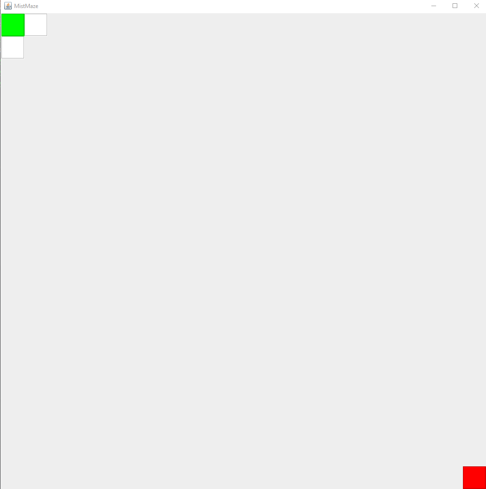
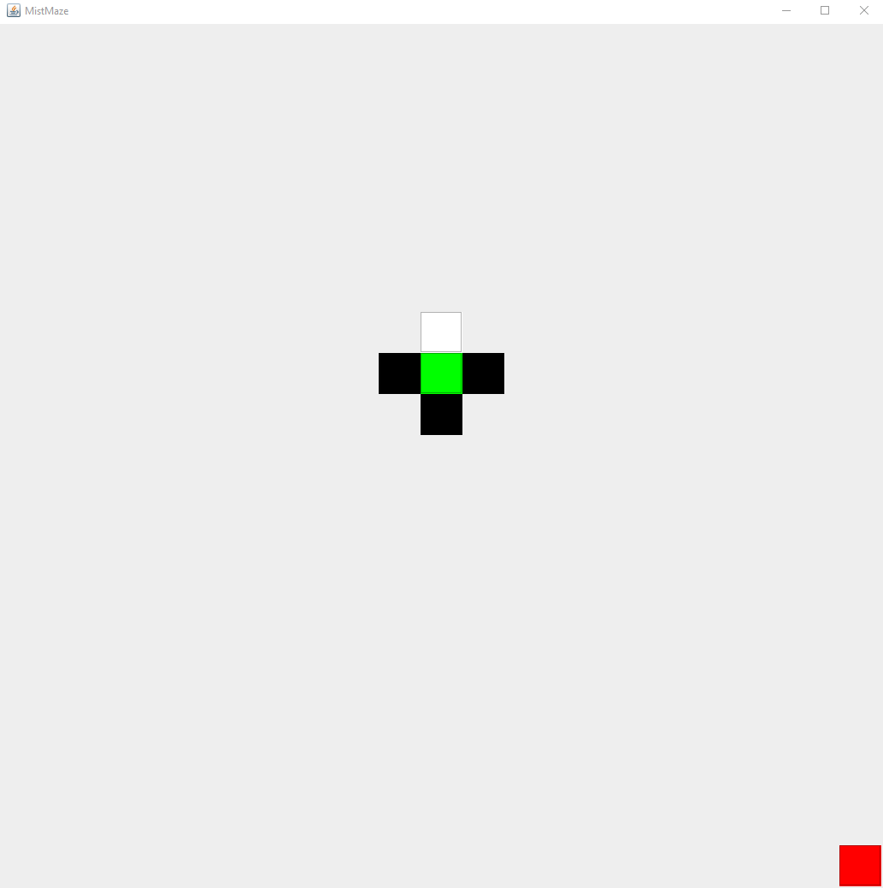
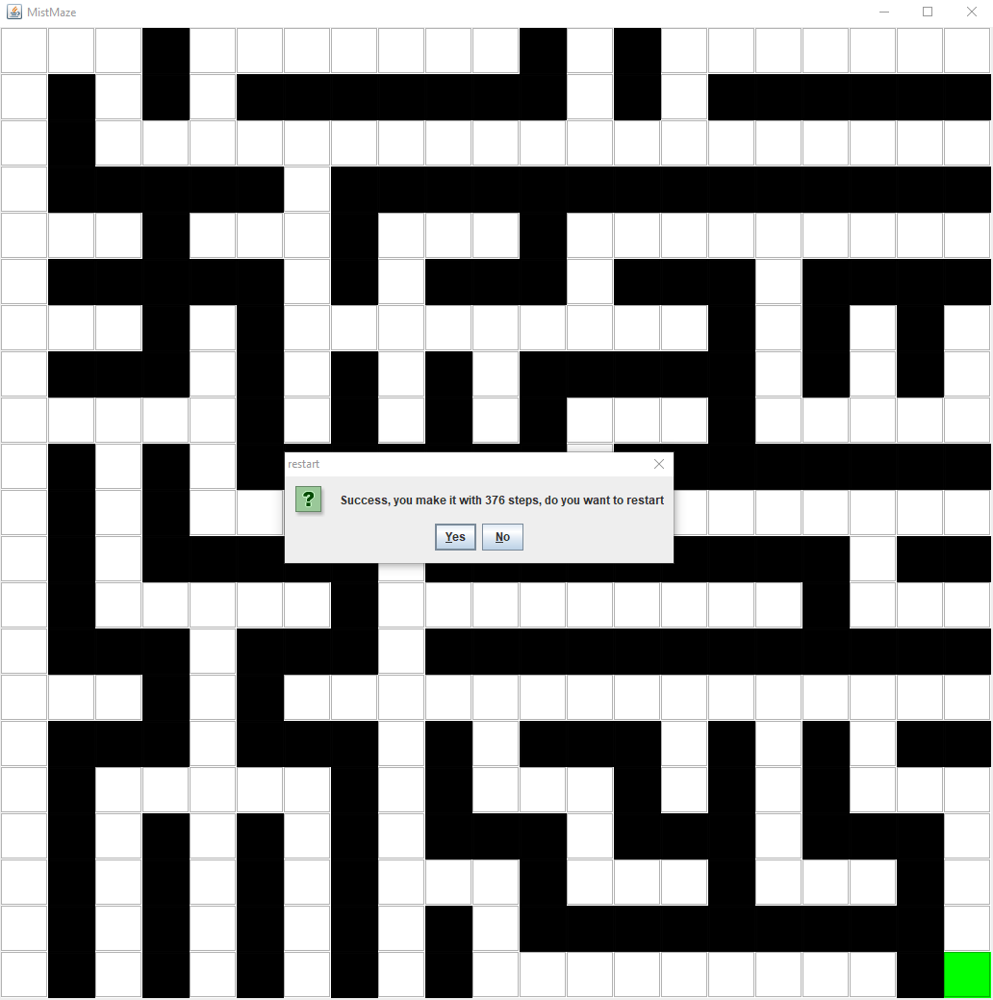

# MistMaze

### Introduction

This is a little maze game. User will start at top left corner and try to find a way out. The exit will always set at right bottom. User can use non-numpad arrow keys on keyboard to control the block move. When playing this maze game, user will only see five grid, the current location, and other four grid at four direction(up, down, left and right). Among those grids, green grid represents the current location, white grid represents road which user can move to and black grid represents wall which means user can not move to. The red grid represents the exit. When user successfully reach the exit, there will be a dialog shows how many steps user use to make it and ask for whether user want to restart the game or exit the game.

------
### presentation

The initial set of this game is 21*21 grid and generate maze by random DFS. The running behavior shows below.

